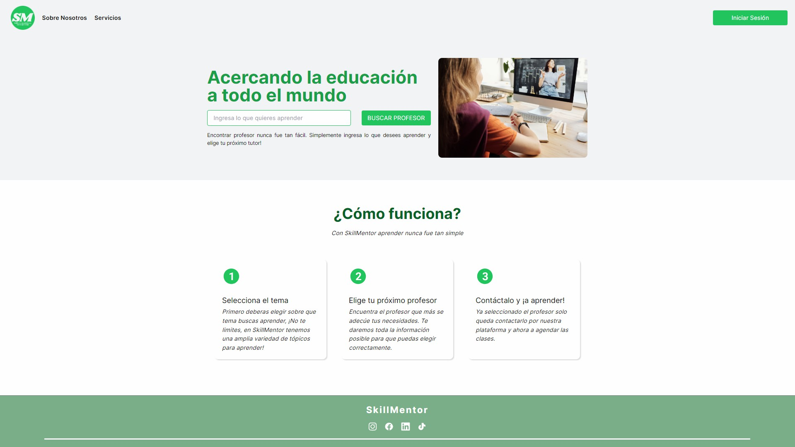

#  SkillMentor



### Introducción

Proyecto de FrontEnd de SkillMentor. Debe utilizarse en conjunto con https://github.com/lucashmunoz/tpo-apis-g02-back

### Instalación

- Clonar el repositorio:
  ```bash
  git clone https://github.com/lucashmunoz/tpo-g02-front.git
  ```
- Dirigirse al directorio tpo-g02-front

  ```bash
  cd tpo-g02-front
  ```

- Instalar dependencias

  ```bash
  npm install
  ```

### Iniciando el proyecto

Para correr el proyecto se debe ejecuar el siguiente comando:

```bash
npm start
```

## 🔌Stack tecnológico utilizado en el proyecto

Esta es la lista de las principales dependencias y sus versiones utilizadas:

- react@18.2.0,
- react-dom@18.2.0,
- react-router-dom@6.16.0,
- styled-components@6.0.8
- axios@1.6.2,
- eslint@8.49.0,
- prettier@3.0.3,
- tailwindcss@3.3.3
